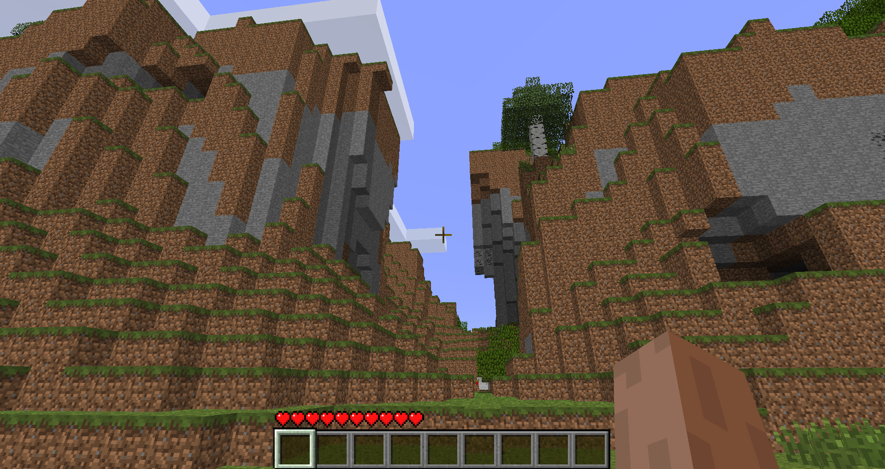

+++
title = "3D Noise Scaling"
date = 2025-02-07

[taxonomies]
tags=["hobby"]
+++

Prior to beta 1.8, Minecraft had a particular style of terrain that appeals to me greatly. 
There are many factors that contribute to this. 
Low movement speed, high rates of weirdness, and chaotic biome placement are all important factors in the experience. 

While developing Pinefruit, I wanted to recreate the experience of old Minecraft terrain. 
As a first step I needed to generate the shape of the terrain itself. 
There are [many factors](https://www.youtube.com/watch?v=CSa5O6knuwI) that go into generating Minecraft's terrain.
A key aspect that is often overlooked, however, is the blockiness of the density noise used to determine the surface's shape. 



Here we can see a valley between two hills. 
What I'd like for you to notice is that the hills are kind of square looking. 


We can see it more clearly here. 
It's neat. 
It's blocky. 
It has a distinctive look to it. 
But why is it that way and how can we recreate it? 

I'm not good at dramatic buildup. 
It's a product of 3d noise interpolation. 
Minecraft interpolates its density noise, presumably in an attempt to reduce computational load. 
It's just an extension of linear interpolation into 3d. 

```rust
fn lerp(x: f32, x1: f32, x2: f32, q00: f32, q01: f32) -> f32 {
	((x2 - x) / (x2 - x1)) * q00 + ((x - x1) / (x2 - x1)) * q01
}
fn lerp3(
	x: f32, y: f32, z: f32, 
	q000: f32, q001: f32, q010: f32, q011: f32, q100: f32, q101: f32, q110: f32, q111: f32, 
	x1: f32, x2: f32, y1: f32, y2: f32, z1: f32, z2: f32, 
) -> f32 {
	let x00 = lerp(x, x1, x2, q000, q100);
	let x10 = lerp(x, x1, x2, q010, q110);
	let x01 = lerp(x, x1, x2, q001, q101);
	let x11 = lerp(x, x1, x2, q011, q111);

	let r0 = lerp(y, y1, y2, x00, x01);
	let r1 = lerp(y, y1, y2, x10, x11);

	lerp(z, z1, z2, r0, r1)
}
```

<!-- TODO: SHOW RESULT TERRAIN -->

It's simple to add this to our terrain generator.
This works pretty well, but it's rather inefficient. 
A scaling 8x8x8 volumes to 16x16x16 with this takes 114,564.06ns. 
Just generating a 16x16x16 noise volume takes 113,809.63ns, which is (just barely) faster!

My first order of business was to refactor that `lerp3` code to reduce the number of divisions. 
In the following code, the t values are the factor of each axis and the q values are the values at each octant. 

```rust
fn lerp(a: f32, b: f32, t: f32) -> f32 {
	a * (1.0 - t) + b * t
}
fn lerp3(
	xt: f32, yt: f32, zt: f32, 
	q000: f32, q001: f32, q010: f32, q011: f32, q100: f32, q101: f32, q110: f32, q111: f32, 
) -> f32 {
	let x00 = lerp(q000, q100, xt);
	let x10 = lerp(q010, q110, xt);
	let x01 = lerp(q001, q101, xt);
	let x11 = lerp(q011, q111, xt);
	let r0 = lerp(x00, x01, zt);
	let r1 = lerp(x10, x11, zt);
	lerp(r0, r1, yt)
}
```

This works pretty well. 
Now we are doing the same task in 95,697.39ns.
For this application I only need to scale the noise by an integer factor, and this gives me some more opportunities for optimization. 

I tried skipping noise interpolation at values where all t values will be zero. 
When doubling the scale of a noise volume, this would reduce the work by 12.5%. 
Oddly enough, this was a bad idea. 
When scaling noise from 8x8x8 to 16x16x16, we experience a slowdown of nearly 14% (95,574.26ns vs 110,722.50ns). 
That's not so great. 

As another avenue, I realized that I could precompute the t values rather than computing them for each cell. 
At the beginning of the function I create an array on the stack which stores the t values for a cell at offset `i` at index `i`. 
When inside the loop, we can fetch the precomputed value instead of performing a floating-point division. 

```rust
let mut t_vals = [0.0; MAX_SCALE];
for i in 0..scale {
	t_vals[i] = i as f32 / scale as f32;
}

for cell in cells {
	...
	let d = cell - (cell / scale) * scale;
	let xt = t_vals[0][d.x as usize];
	let yt = t_vals[1][d.y as usize];
	let zt = t_vals[2][d.z as usize];
	...
}
```

I used this code to generate 16x16x16 volumes of noise, analogous to a chunk in Minecraft. 
Without interpolation the noise was generated in 109,302.56ns. 
With interpolation scaling from 8x8x8, the noise was generated in 89,285.23ns.
That's a win, being 22% faster than without this optimization! 

In the beginning we were generating noise volumes in 114,564.06ns, and now we are generating them in 89,285.23ns. 
I've had fun optimizing this and my optimizations actually worked. 
This is acceptable to me. 

But Minecraft also uses per-axis interpolation. 
Chunks of size 16x16x16 are generated from 8x8x4 volumes of noise. 
My code was built with this in mind, and it's pretty much ready to go. 
But oh no! 
The crate I'm using to generate the noise values, [simdnoise](https://crates.io/crates/simdnoise), does not allow for per-axis frequency scaling. 
A [pull request](https://github.com/verpeteren/rust-simd-noise/pull/17) added the feature five years ago, but there have been no new releases since then! 
Even though it would be simple, I'm still too lazy to pull the thing from github directly.
I've put it in the backlog for now, and hopefully we'll be able to experiment with that *eventually*. 
